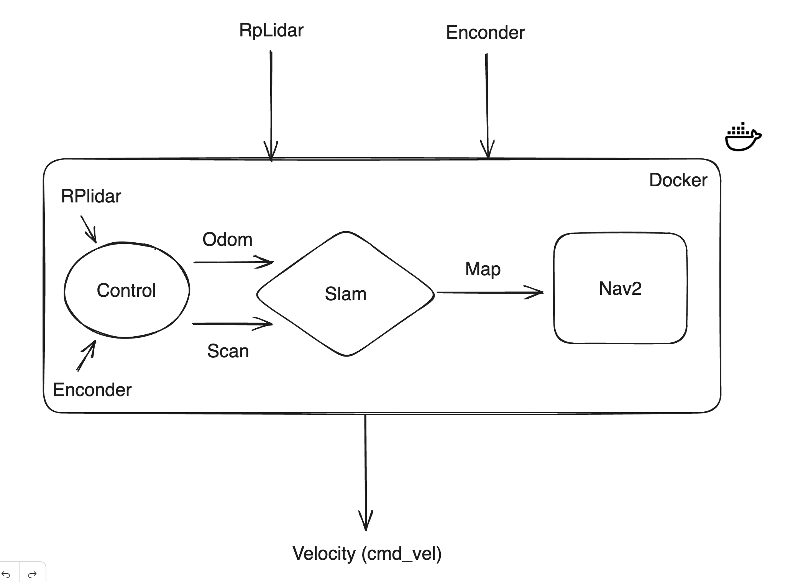

# Configuração do Sistema

O sistema utilizado no projeto foi dividido em pacotes, seguindo uma estrutura similar ao ROS (Robot Operating System). O pacote principal, chamado navtech, contém todo o sistema de simulação e navegação do robô.

```
docs/                     # Documentação do projeto
src/
├── navtech/
│   ├── robot/
│   │   ├── config/       # Arquivos de configuração
│   │   ├── description/  # Arquivos URDF
│   │   ├── launch/       # Arquivos de lançamento
│   │   ├── robot/        # Arquivos de código-fonte
│   │   ├── worlds/       # Arquivos de mundo
│   │   ├── CMakeLists.txt
│   │   ├── package.xml

```  

A estrutura do pacote `navtech` é a seguinte:

* A pasta `config` contém todas as especificações do robô para mapeamento e navegação, além de possuir o mapa do ambiente e um arquivo de RViz para visualização do robô.

* A pasta `description` contém o arquivo URDF do robô, que é utilizado para a simulação do robô, juntamente com os controladores e sensores especificados no arquivo `robot.urdf.xacro`.

* A pasta `launch` contém os arquivos de lançamento do robô, que são utilizados para iniciar a simulação do robô. Os principais arquivos são `navigation.launch` e `simulation.launch`, que são utilizados para iniciar a navegação e a simulação do robô, respectivamente.

* As pastas `test` e `worlds` contêm os arquivos de teste e os arquivos de mundo, respectivamente.

## Configuração do Ambiente
Para configurar o ambiente, é necessário ter o Docker instalado em sua máquina, pois todo o sistema é construído em cima de um container. Você pode encontrar as instruções de instalação do Docker em `Docker`.

O arquivo `Makefile` contém todos os comandos necessários para a execução do sistema. Para executar o sistema, basta abrir o terminal e executar o comando `make run`.

Isso iniciará a simulação juntamente com o objetivo do robô, que é passar por todos os waypoints, demonstrando a navegação do robô.

Certifique-se de ter todas as dependências e requisitos de software instalados antes de executar o sistema.

Para mais informações e detalhes sobre o projeto, consulte a documentação disponível na pasta `docs`.




